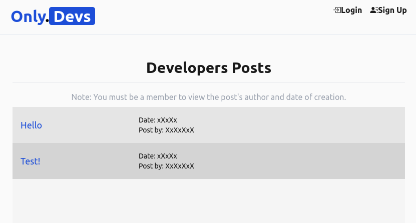
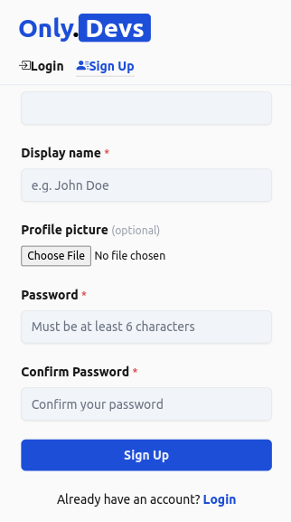
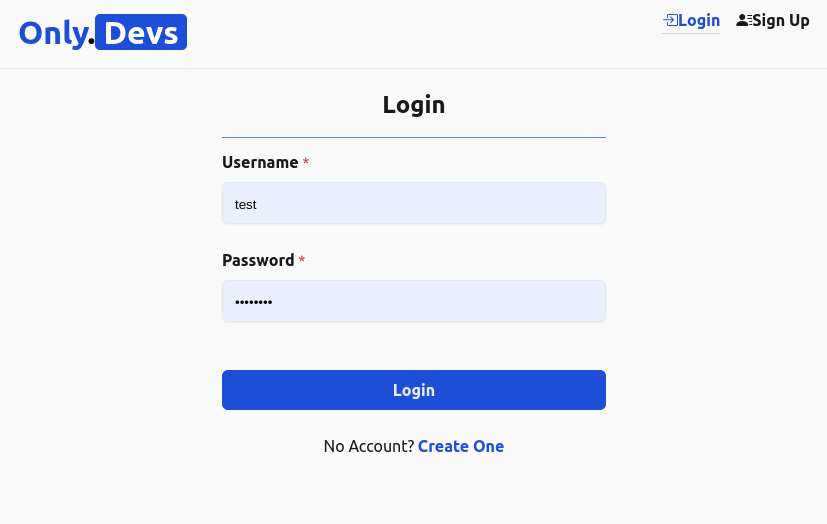
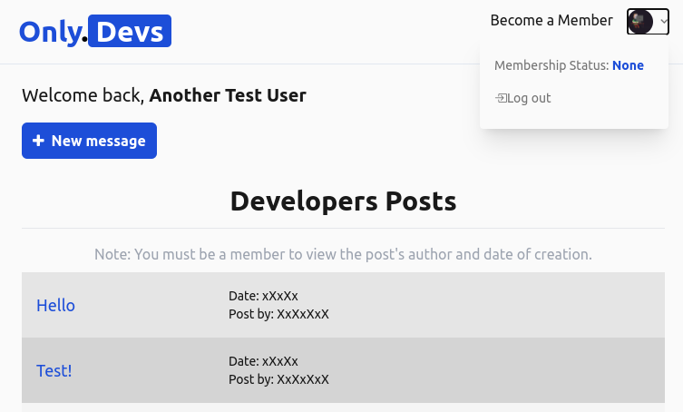
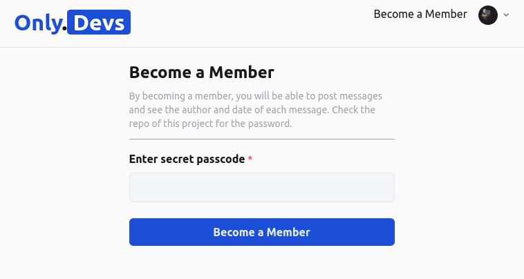
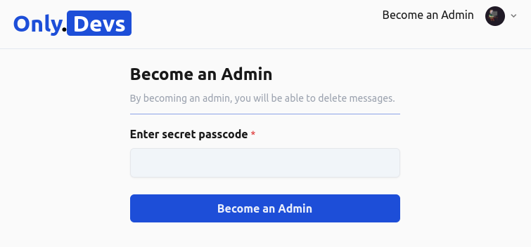
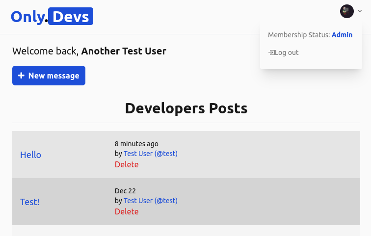

# Only.Devs (an only member app for devs)

### You can visit the live project at: 

## You can create a new user by clicking in the "Sign Up" link

### this is the reponsive mode:

## Afer filling all the fields and clicking on Sign Up, if the registration is successful you will be redirected to the login form

## If you want to see the date and the author of the messages that you saw at the first time the app loaded, you MUST be a member and you will need the right password. No worries, is below the following image

# ** Members Only Passcode: "memberd3v"

## Now you, as a "Member" status, you can see who wrote the message and the date, but maybe you want to delete a message. So you need to become and Admin. Click on "Become an Admin" and enter the right password (you can figure the pass?) Hint: is similar to the member one but now you want to be an "admin" right? ;)

## Finally, when you are an Admin, you will be able to delete the messages. Be responsible =)

# CREDTIS:

### I took this repo: https://github.com/Sharkri/members-only/tree/main and made some minor changes, like colors, icons and default image profile but I learnt a lot in my first attempt building this project, but I got stuck for a while and then I decided to look the repo above and make it work. So thanks again!
